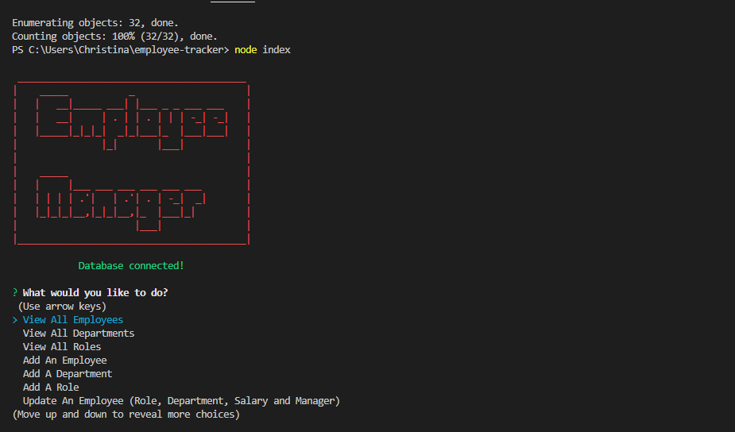

# Employee-Tracker

Challenge 12

## Description

This is a command-line application that allows a company to manage its employee database. The application is built using Node.js, Inquirer, MySQL, and console.table/Chalk for styling.

## Table of Contents:

* [Installation](#installation)
* [Usage](#usage)
* [Screenshot](#screenshot)
* [Demo](#demo)
* [License](#license)
* [Questions](#Questions)
* [Email](#Email)
* [Github](#Github)
* [Owner](#Owner)

## Installation:

Type "npm i" into your terminal to download all required dependencies.

## Usage 

You will need MySql Downloaded for this repo!

1. Once that is done you may log into your MySql using the following commands ``mysql -u root -p`` within the db folder.

2. In the Sql commandline please type and submit the following: ``source ./schema.sql`` and submit then, ``source ./seeds.sql`` to create a database.

3. Open index.js in the terminal and type ``node index`` to run the application! You're good to go, enjoy!

## Screenshot:

## Demo

## License

This project is licensed under the MIT license. Click [here](https://opensource.org/licenses/MIT) for more information. 

## Questions & Email

Please reach out to chrisinta.e.c.barberi@gmail.com

## Github

Please visit me on [Github](https://github.com/Christinaecb)!